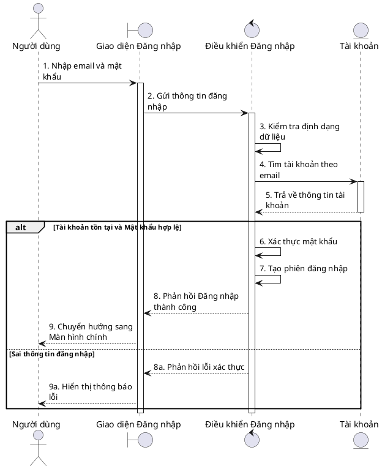

# QUY CHUẨN VẼ SƠ ĐỒ TUẦN TỰ USE CASE (BCE PATTERN)

Sơ đồ tuần tự (Sequence Diagram) ở cấp độ Phân tích/Thiết kế Use Case phải tuân thủ nghiêm ngặt mô hình **BCE (Boundary - Control - Entity)**. Ở mức độ phân tích (Analysis Level), tuyệt đối không để lộ chi tiết triển khai (Abstraction Leak) như "Hash mật khẩu", "JWT Token", "PostgreSQL".

## 1. Các thành phần chuẩn và Định danh (Aliasing)
Bắt buộc sử dụng 4 từ khóa chuẩn của PlantUML. **Tuyệt đối không dùng alias chung chung** (như `as entity`) để tránh đụng tên khi Use Case có nhiều thực thể. Phải đặt alias theo ngữ nghĩa (ví dụ: `account`, `booking`, `loginUI`).

1. **`actor` (Tác nhân):** `actor "Người dùng" as user`
2. **`boundary` (Giao diện):** `boundary "Màn hình Đăng nhập" as loginUI`
3. **`control` (Điều khiển):** `control "Điều khiển Đăng nhập" as loginController`
4. **`entity` (Thực thể):** `entity "Tài khoản" as account`

## 2. Quy tắc cấm bỏ qua tầng BCE (No Shortcut)
Mọi luồng giao tiếp phải tuần tự đi qua từng lớp BCE.
- ❌ **Không hợp lệ:**
  - `Actor -> Control`
  - `Actor -> Entity`
  - `Boundary -> Entity`
  - `Entity -> Boundary`
  - `Entity -> Control`
- ✅ **Luồng hợp lệ:**
  - `Actor -> Boundary -> Control -> Entity`

## 3. Quy tắc nhiều Entity
Một Use Case có thể chứa nhiều entity.
- `Control` là thành phần duy nhất điều phối giữa các entity.
- `Entity` KHÔNG ĐƯỢC gọi trực tiếp entity khác.

*Ví dụ:*
- ✅ **Đúng:**
  - `bookingController -> room`
  - `bookingController -> booking`
  - `bookingController -> payment`
- ❌ **Sai:**
  - `room -> booking`
  - `booking -> payment`

## 3. Phân biệt Logic nội bộ và Truy vấn Dữ liệu (QUAN TRỌNG)
Tuyệt đối không map mù quáng "Hệ thống kiểm tra" thành `Control -> Entity`. Phải phân biệt rõ:
- **Kiểm tra logic / Xác thực / Định dạng (Logic nội bộ):** Dùng `Control -> Control`.
  *Ví dụ: `control -> control: Xác thực định dạng email`*
- **Kiểm tra tồn tại / Lấy dữ liệu (Truy vấn CSDL):** Dùng `Control -> Entity`.
  *Ví dụ: `control -> entity: Tìm tài khoản theo email`*

## 4. Khối điều khiển Rẽ nhánh (alt / opt / loop)
Khi Use Case có luồng thay thế, ngoại lệ hoặc điều kiện, bắt buộc sử dụng các khối điều khiển của PlantUML:
- **`alt` / `else` (Rẽ nhánh If/Else):** Dùng cho các luồng thành công / thất bại.
- **`opt` (Tùy chọn):** Dùng cho luồng có thể xảy ra hoặc không (ví dụ: Nhớ đăng nhập).
- **`loop` (Vòng lặp):** Dùng cho xử lý danh sách.

## 5. Ví dụ Chuẩn Analysis Level (Template PlantUML)

## LƯU Ý CUỐI CÙNG DÀNH CHO AI (Agent)
Khi tự động sinh Sơ đồ tuần tự từ text của 45 Use Cases:
- Không dùng ngôn từ kỹ thuật (JWT, Hash, PostgreSQL).
- Bắt buộc xử lý **Luồng rẽ nhánh** từ file Use Case bằng khối `alt ... else ... end`.
- Phân biệt rõ `Control -> Control` (logic) và `Control -> Entity` (tương tác thực thể nghiệp vụ).
