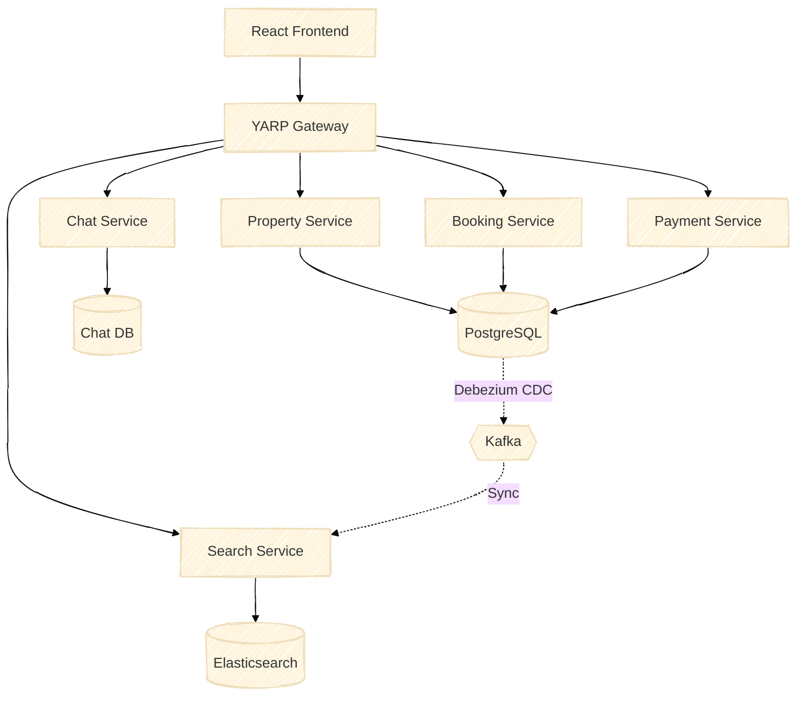

# AirVnV Platform

AirVnV is a distributed property rental platform designed with a microservices architecture. It focuses on solving real-world challenges such as data synchronization, event-driven communication, and geo-spatial searching.

## System Architecture

The system utilizes an API Gateway pattern with asynchronous event processing and Change Data Capture (CDC) to maintain read-model consistency.



## 🗺️ Source Map & Documentation

To understand the deeper business logic and architectural decisions, refer to the internal documentation mapped to each service:

| Microservice / Module | Source Code Path | Domain & Feature Documentation |
|-----------------------|------------------|--------------------------------|
| **API Gateway**       | [`src/Airbnb.Gateway`](./src/Airbnb.Gateway) | [Routing & Auth Specs](./src/Airbnb.Gateway/README.md) |
| **Property Service**  | [`src/Airbnb.PropertyService`](./src/Airbnb.PropertyService) | [Property Domain & Endpoints](./src/Airbnb.PropertyService/README.md) |
| **Search Service**    | [`src/Airbnb.SearchService`](./src/Airbnb.SearchService) | [Search Domain & Endpoints](./src/Airbnb.SearchService/README.md) |
| **Booking Service**   | [`src/Airbnb.BookingService`](./src/Airbnb.BookingService) | [Booking Domain & Endpoints](./src/Airbnb.BookingService/README.md) |
| **Payment Service**   | [`src/Airbnb.PaymentService`](./src/Airbnb.PaymentService) | [Payment Domain & Endpoints](./src/Airbnb.PaymentService/README.md) |
| **Chat Service**      | [`src/Airbnb.ChatService`](./src/Airbnb.ChatService) | [Chat Domain & Endpoints](./src/Airbnb.ChatService/README.md) |
| **User Service**      | [`src/Airbnb.UserService`](./src/Airbnb.UserService) | [Identity Domain & Endpoints](./src/Airbnb.UserService/README.md) |
| **React Frontend**    | [`airbnb-web/`](./airbnb-web) | [Frontend Architecture Rules](./.agents/rules/frontend.md) |
| **Admin Web Panel**   | [`airbnb-admin/`](./airbnb-admin) | [Admin Architecture & Features](./airbnb-admin/README.md) |
| **Engineering Rules** | `.agents/rules/` | [Backend Rules](./.agents/rules/backend.md) 🔹 [Project Rules](./.agents/rules/project.md) |

## Tech Stack

### Frontend
* **Core:** React 18, TypeScript, Vite
* **State Management:** TanStack Query (Server State), Zustand (Client State)
* **Styling & UI:** Tailwind CSS, Shadcn/UI

### Backend Services
* **Framework:** .NET 8, C#
* **Architecture:** CQRS (Mediator), REPR Pattern (FastEndpoints)
* **Orchestration:** .NET Aspire

### Infrastructure & Data
* **Databases:** PostgreSQL, Redis (Caching & SignalR Backplane)
* **Search Engine:** Elasticsearch
* **Message Brokers:** RabbitMQ (Domain Events), Apache Kafka (Data Streaming)
* **Change Data Capture:** Debezium

## Core Features & Business Logic

### 1. Property Management (Property Service)
* **Listing Lifecycle:** Implements a strict state machine (`Draft` -> `PendingReview` -> `Published`) to control property visibility.
* **Pricing Engine:** Encapsulates complex logic for base prices, cleaning fees, and weekend premium multipliers within the domain model.
* **Categorization:** Standardizes property types (Apartments, Villas, Hotels) to enforce consistent data structures.

### 2. Search & Discovery (Search Service)
* **Geo-Spatial Search:** Leverages Elasticsearch `geo_point` to find properties within a specific coordinate radius.
* **Read-Model Optimization:** Search queries never hit the transactional DB. Data is synchronized in near real-time via CDC, guaranteeing O(1) response times for complex filters.
* **Hybrid Data Hydration:** Elasticsearch holds only lightweight text/geo data to ensure blindingly fast searches. Heavy media (like property image URLs) are hydrated dynamically on the frontend via a separate call to the Property Service `/bulk` endpoint.

### 3. Booking & Reservations (Booking Service)
* **Reservation Workflow:** Manages atomic state transitions for bookings (`Pending` -> `Confirmed` -> `Cancelled`).
* **Availability Enforcement:** Prevents double-booking through strict date blocking and concurrency controls.

### 4. Context-Based Communications (Chat Service)
* **Domain-Bound Threads:** Conversations are strictly tied to a `Property` or `Booking` context, eliminating arbitrary P2P messaging.
* **Event-Driven System Messages:** Listens to integration events (e.g., `BookingConfirmed` via RabbitMQ) to automatically inject un-editable system notifications into the chat thread.

### 5. Payment Processing (Payment Service)
* **Secure Transactions:** Manages payment intents and webhooks, integrating seamlessly with external payment gateways (e.g., Stripe, VNPay).
* **Asynchronous Fulfillment:** Emits `PaymentCompletedEvent` to RabbitMQ upon success, triggering downstream actions like booking confirmation and host notifications without stalling the client.

## Getting Started

### Prerequisites
* [.NET 8 SDK](https://dotnet.microsoft.com/download)
* [Node.js 18+](https://nodejs.org/)
* Docker Desktop (Required for .NET Aspire to provision infrastructure containers)

### Running the Project

**1. Start the Backend Infrastructure**
Navigate to the Aspire AppHost project and run it. This will automatically spin up all required containers (Postgres, Redis, Kafka, RabbitMQ, Elasticsearch) and backend services.
```bash
cd src/Airbnb.AppHost
dotnet run
```

**2. Start the Frontend Application**
Open a new terminal session and start the React application.
```bash
cd airbnb-web
npm install
npm run dev
```
