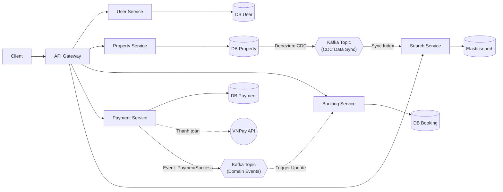
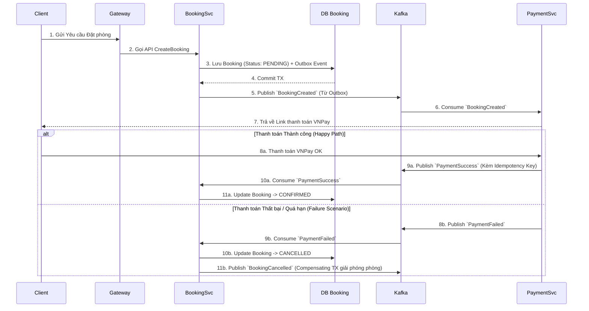

# Sơ đồ Kiến trúc Hệ thống (System Architecture Diagram) - Airbnb Clone

Phiên bản tối giản (Minimalist), phân tách rõ ràng **Kafka Topics** thành 2 cụm riêng biệt để thể hiện đúng vai trò của từng luồng (CDC vs Domain Events).

## Giải thích luồng cơ bản

1. **Trục dọc (Microservices & DB độc lập):** `API Gateway` điều phối request. Các service đều sở hữu DB độc lập. `Payment Service` tích hợp với VNPay.
2. **Luồng Kafka Data Sync (CDC):** Khi `DB Property` thay đổi, **Debezium CDC** sẽ bắt thay đổi dưới tầng database và đẩy vào cụm **Kafka Topic (CDC)**. `Search Service` sẽ consume topic này để nạp thẳng vào Elasticsearch (Đảm bảo đồng bộ 1-1 không rườm rà logic).
3. **Luồng Kafka Domain Events:** Khi thanh toán xong, `Payment Service` chủ động bắn một sự kiện nghiệp vụ (`PaymentSuccess`) vào cụm **Kafka Topic (Domain Events)**. `Booking Service` lắng nghe topic này để cập nhật trạng thái chốt phòng. Sự phân tách topic giúp hệ thống rạch ròi giữa việc "Đồng bộ dữ liệu" và "Giao tiếp nghiệp vụ".

---

## Phân tích Luồng Dữ liệu & Kịch bản Sự cố (Data Flow & Failure Scenarios)

Dưới đây là các phân tích chuyên sâu (Staff-level) về luồng dữ liệu thực tế và cách hệ thống tự phục hồi (Resilience) khi đối mặt với các thảm họa ở cấp độ Production.

### 1. Luồng Đặt phòng (Booking Flow) & Kịch bản Fail giữa chừng

Luồng này sử dụng **Choreography Saga** kết hợp **Transactional Outbox** để đảm bảo tính nhất quán dữ liệu mà không bị khóa (lock) hệ thống.

**Phân tích rủi ro & Chống trùng lặp (Idempotency):**

- *Vấn đề:* Nếu `PaymentSvc` bắn `PaymentSuccess` 2 lần vào Kafka (do mạng chập chờn hoặc retry).
- *Xử lý:* `BookingSvc` trước khi update DB sẽ check cột `PaymentEventId` (Hoặc dùng cơ chế Upsert). Nếu event này đã được xử lý, nó sẽ bỏ qua. Ngăn chặn triệt để thảm họa Book đúp phòng.

### 2. Kịch bản "CDC Delay" (Độ trễ đồng bộ Search)

CDC (Debezium) là cơ chế đồng bộ bất đồng bộ (Asynchronous). Ở môi trường High-scale, việc CDC bị delay vài giây do tải nặng là chuyện bình thường.

**Tình huống:** Chủ nhà vừa đổi giá phòng từ 500k -> 400k. Ngay lập tức khách hàng Search.

- *Vấn đề phát sinh:* Do CDC bị delay, Elasticsearch vẫn trả về giá cũ (500k). Khách hàng bấm vào xem chi tiết thì lại thấy giá 400k (do trang chi tiết gọi thẳng vào DB thật của `PropertySvc`). Gây trải nghiệm cực tồi tệ (Data Inconsistency).
- *Cách Hệ thống phòng thủ:*
  1. Chấp nhận **Eventual Consistency** (Nhất quán cuối) ở trang Search (Search list có thể sai giá trong vài giây).
  2. Bắt buộc validate lại dữ liệu thật (Source of Truth) khi user vào trang Checkout. Nếu giá đã đổi, hệ thống văng thông báo yêu cầu xác nhận lại mức giá mới trước khi đẩy qua VNPay.
  3. Áp dụng **Hedging** ở YARP: Nếu Elasticsearch phản hồi quá chậm (>500ms), tự động bắn request thứ 2 sang một node Search dự phòng để giảm Tail Latency.

### 3. Kịch bản Thảm họa: Kafka Down (Chết Message Broker)

Kafka là xương sống của hệ thống Microservices. Nếu Kafka sập, toàn bộ giao tiếp đứt gãy.

**Tình huống:** Khách hàng thanh toán VNPay xong, `PaymentSvc` chuẩn bị bắn event `PaymentSuccess` sang `BookingSvc` để chốt phòng thì Kafka lăn ra sập.

- *Nếu thiết kế tồi (Direct Publish):* `PaymentSvc` cố đẩy message, bị timeout ném Exception -> Trả về lỗi 500 cho khách hàng mặc dù họ **đã bị trừ tiền trong thẻ** -> Thảm họa CSKH.
- *Cách Hệ thống sinh tồn (Outbox Pattern Survival):*
  1. `PaymentSvc` KHÔNG bắn trực tiếp vào Kafka. Nó lưu giao dịch VNPay và một record event `PaymentSuccess` vào bảng `Outbox` nằm chung trong `DB_Pay` bằng **1 Transaction duy nhất**.
  2. Việc lưu DB cục bộ thành công -> Khách hàng nhận thông báo "Thanh toán thành công, hệ thống đang xử lý chốt phòng".
  3. Một **Background Worker** (hoặc chính Debezium) sẽ liên tục quét bảng `Outbox`. Vì Kafka down, Worker này báo lỗi nhưng sẽ được bọc bởi **Polly Retry** (Exponential Backoff).
  4. 30 phút sau, hệ thống Kafka được DevOps cứu sống lại.
  5. Worker tự động đọc bảng `Outbox` và đẩy nốt hàng loạt event `PaymentSuccess` đang ứ đọng lên Kafka.
  6. `BookingSvc` nhận được event và âm thầm chốt phòng (CONFIRMED). Hệ thống tự phục hồi hoàn toàn mà không bốc hơi bất kỳ byte dữ liệu nào, và khách hàng cũng không hề biết có sự cố kỹ thuật vừa xảy ra.
