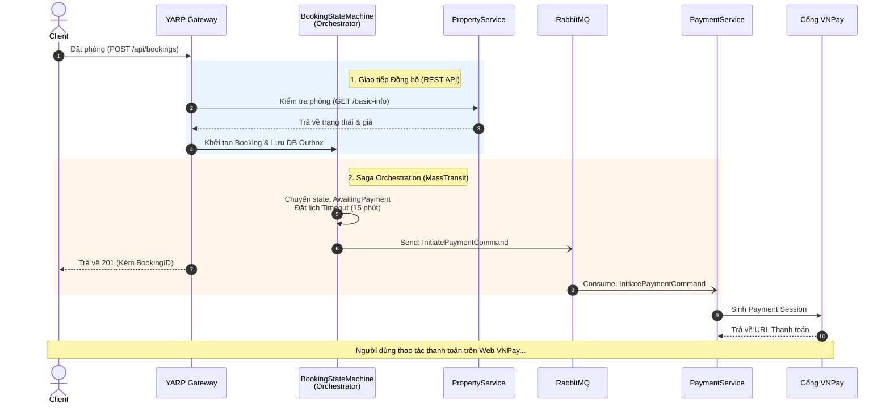
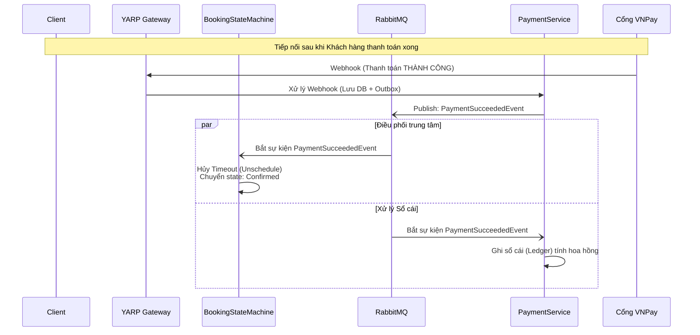
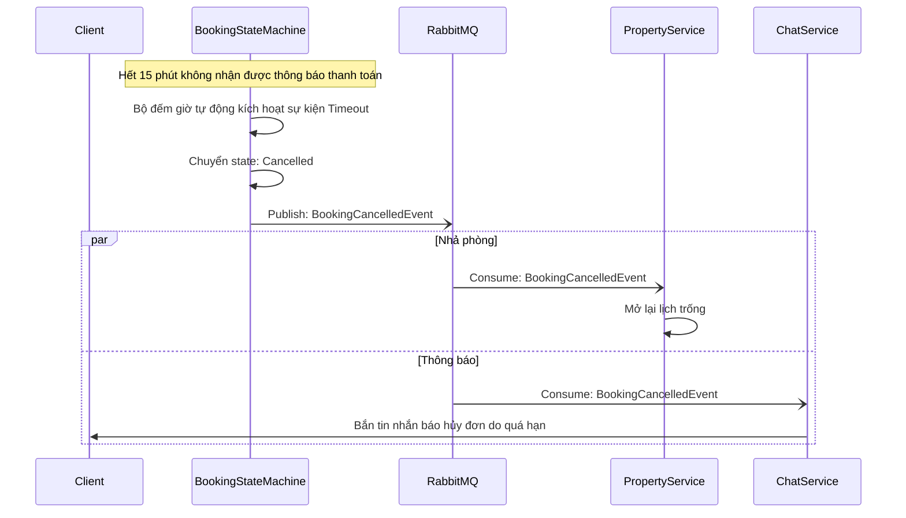
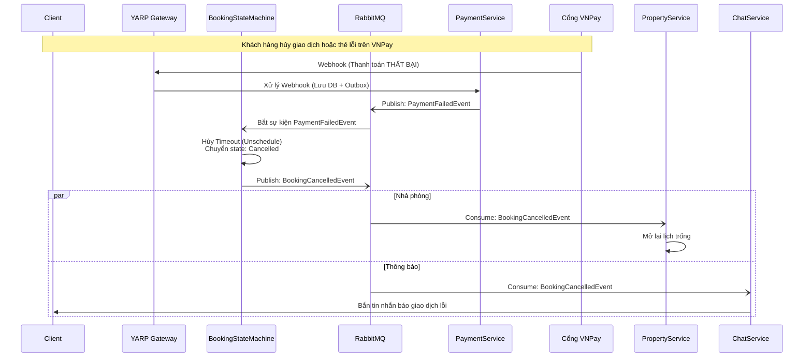
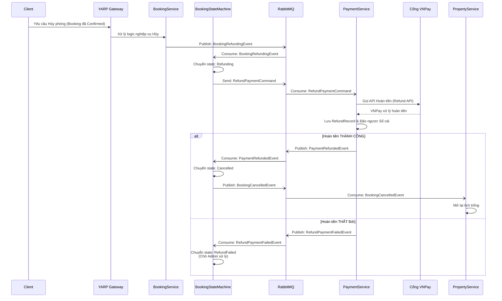
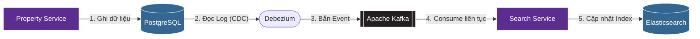

# KỊCH BẢN THUYẾT TRÌNH BÁO CÁO CUỐI KỲ
**Đề tài:** AirVnV - Hệ thống Đặt phòng Lưu trú theo Kiến trúc Hướng dịch vụ (Microservices)
*(Tài liệu này được biên soạn bám sát cấu trúc của Báo cáo Đồ án Môn học)*

---

## 🟢 1. Slide Mở Đầu (1 Slide)
**Tiêu đề:** Xây dựng Hệ thống Đặt phòng Lưu trú (AirVnV) theo Kiến trúc Hướng Dịch vụ (Microservices)
**Môn học:** [Tên môn học]
**Giảng viên hướng dẫn:** [Tên giảng viên]

**Danh sách thành viên & Đóng góp:**
| STT | Họ và Tên | MSSV | Vai trò / Nhiệm vụ đảm nhận | Mức độ hoàn thành |
| :--- | :--- | :--- | :--- | :--- |
| 1 | [Tên TV 1] | [MSSV 1] | **Team Lead, Backend**: Thiết kế Kiến trúc tổng thể, YARP Gateway, Identity & Property Service | 100% |
| 2 | [Tên TV 2] | [MSSV 2] | **Backend**: Booking & Payment Service, thiết lập Kafka Event-Driven, Notification Service | 100% |
| 3 | [Tên TV 3] | [MSSV 3] | **Frontend**: Xây dựng UI React, tích hợp Zustand, Tanstack Query & API Integration | 100% |

---

## 🟢 2. Phát Biểu Bài Toán & Nhu Cầu Hướng Dịch Vụ (2 Slides)
*(Tương ứng với Chương I: Tổng Quan & Chương II: Phân tích YC trong Báo cáo)*

**Slide 2.1: Bối cảnh & Mục tiêu**
*   **Bối cảnh:** Thị trường du lịch phát triển mạnh, cần một nền tảng kết nối Chủ nhà (Host) và Khách thuê (Guest) minh bạch, xử lý được lượng truy cập lớn dịp lễ tết.
*   **Mục tiêu:** Xây dựng hệ thống hoàn chỉnh từ Front-end tới Back-end, có khả năng xử lý nghiệp vụ phức tạp: tìm kiếm phòng, đặt lịch, thanh toán trực tuyến, đánh giá.

**Slide 2.2: Lý do chọn Kiến trúc Microservices (So với Monolith)**
*   **Khả năng mở rộng (Scalability):** Cho phép scale độc lập các module chịu tải cao (VD: Search Service dùng Elasticsearch) mà không ảnh hưởng toàn hệ thống.
*   **Tính độc lập & Chịu lỗi (Fault Isolation):** Nếu Payment Service gặp sự cố, hệ thống vẫn cho phép người dùng lướt xem phòng bình thường.
*   **Linh hoạt công nghệ:** Cho phép mỗi service sử dụng một Database riêng biệt, tối ưu cho đặc thù nghiệp vụ.

---

## 🟢 3. Kiến Trúc Hệ Thống - SOA/Microservices (3 Slides)
*(Tương ứng với Chương II: Thiết kế hệ thống)*

**Slide 3.1: Sơ đồ Kiến trúc Tổng thể (Architecture Diagram)**
*   **Client Layer:** Ứng dụng Web sử dụng React/Shadcn UI.
*   **API Gateway Layer:** **YARP Gateway** đóng vai trò là "Cổng bảo vệ" (Single entry-point), xử lý định tuyến (Routing), SSL, và xác thực.
*   **Service Discovery:** Dùng **.NET Aspire** để quản lý các node và định tuyến mạng giữa các dịch vụ.

**Slide 3.2: Danh sách Bounded Contexts (Các Dịch vụ)**
1.  **Identity Service:** Xác thực User, quản lý Roles.
2.  **Property Service:** Quản lý thông tin nhà/phòng, hình ảnh.
3.  **Search Service:** Đồng bộ dữ liệu phục vụ tìm kiếm toàn văn siêu tốc.
4.  **Booking Service:** Quản lý đặt phòng, xử lý xung đột lịch (Availability).
5.  **Payment Service:** Xử lý thanh toán, giao tiếp VNPay/Stripe, hoàn tiền.
6.  **Chat Service:** Chat realtime giữa Host và Guest.

**Slide 3.3: Lược đồ Dữ liệu Phân tán (Database-per-Service)**
*   **Nguyên tắc cốt lõi:** Tuyệt đối không query chéo Database để đảm bảo Loose Coupling.
*   **Lưu trữ:** Mỗi service quản lý PostgreSQL riêng biệt. Dữ liệu tham chiếu chéo thông qua `Guid`.
*   **Mẫu thiết kế (Design Pattern):** Áp dụng **CQRS** (Command Query Responsibility Segregation) bằng thư viện **MediatR** + **FastEndpoints** để tách biệt hoàn toàn luồng Đọc và Ghi, tăng performance.

---

## 🟢 4. Giải Pháp Tích Hợp & Giao Tiếp Giữa Các Dịch Vụ (3 Slides)
*(Tương ứng với Chương II: Áp dụng Mẫu thiết kế - Phần "Ăn điểm" nhất của Đồ án)*

**Slide 4.1: Giao Tiếp Đồng Bộ (REST API - Synchronous)**
*   Sử dụng `HttpClient` để truy vấn thông tin tham chiếu (Reference Data) tức thời.
*   **Ví dụ thực tế từ mã nguồn:**
    *   `BookingService` $\rightarrow$ `PropertyService`: Gọi `/api/properties/{id}/basic-info` xác thực phòng trước khi đặt, lấy thông tin tính Thuế (`/api/internal/master-data/countries/{code}`).
    *   `PaymentService` $\rightarrow$ `BookingService`: Gọi `/api/internal/bookings/{id}` để đối soát số tiền thanh toán.
    *   `ChatService` $\rightarrow$ `PropertyService` & `UserService`: Lấy thông tin hiển thị Avatar và Ảnh thu nhỏ của phòng.

**Slide 4.2: Giao Tiếp Bất Đồng Bộ & Luồng Sự Kiện (Saga Orchestration)**
*   Áp dụng **Event-Driven Architecture** qua **RabbitMQ** (kết hợp **MassTransit**).
*   **Luồng Saga Orchestration (Điều phối trung tâm):** Hệ thống sử dụng `BookingStateMachine` làm Nhạc trưởng (Orchestrator) để điều hướng toàn bộ quy trình:
    
    **🟢 Trường hợp thành công (Happy Case):**
    1.  `BookingStateMachine` khởi tạo state $\rightarrow$ Gửi lệnh (Send) `InitiatePaymentCommand` đến `PaymentService` và đặt lịch Timeout (15 phút).
    2.  `PaymentService` bắt lệnh $\rightarrow$ Tạo phiên thanh toán VNPay.
    3.  Khách hàng thanh toán xong, `PaymentService` publish sự kiện `PaymentSucceededEvent`.
    4.  `BookingStateMachine` bắt sự kiện $\rightarrow$ Hủy lịch Timeout, chuyển trạng thái Booking thành *Confirmed*.
    5.  Đồng thời `PaymentService` cũng tự bắt sự kiện này để ghi Sổ cái (Ledger) chia hoa hồng cho Host.

    **🔴 Trường hợp thất bại / Quá hạn (Bad Case):**
    1.  `BookingStateMachine` khởi tạo state và kích hoạt bộ đếm giờ Timeout (15 phút).
    2.  Hết 15 phút mà khách hàng chưa thanh toán thành công, bộ đếm giờ tự động kích hoạt sự kiện Timeout.
    3.  State Machine chuyển trạng thái Booking sang *Cancelled* và publish `BookingCancelledEvent`.
    4.  Các service liên quan (Property, Chat) có thể lắng nghe sự kiện này để nhả lịch trống hoặc gửi thông báo.

**Slide 4.3: Đảm bảo Tính nhất quán dữ liệu (Data Consistency)**
Giải quyết bài toán Dual-Write và Phân mảnh dữ liệu:
*   **Transactional Outbox Pattern (Đảm bảo gửi Message):** Lưu Event vào bảng `OutboxMessages` cùng 1 DB Transaction với logic nghiệp vụ. Tránh tình trạng lưu DB thành công nhưng lỗi mạng rớt RabbitMQ.
*   **Change Data Capture (CDC) với Debezium:** `PropertyService` thay đổi dữ liệu $\rightarrow$ Debezium đọc log (WAL) của PostgreSQL đẩy lên **Kafka** $\rightarrow$ `SearchService` (Elasticsearch) bắt event thô này từ Kafka để index ngay lập tức mà không cần gọi API đồng bộ. *(Lưu ý: Hệ thống dùng RabbitMQ cho Saga nội bộ và Kafka chuyên biệt cho Data Pipeline / CDC).*
*   **Event-based Cache Invalidation:** `BookingService` tự xóa Cache tính Thuế khi nhận được sự kiện `TaxUpdatedEvent` từ `PropertyService`.

---

## 🟢 5. Demo Sản Phẩm Thực Tế (1 Slide tiêu đề)
*(Tương ứng với Chương III: Triển khai hệ thống)*

**Kịch bản Demo Trực tiếp:**
1.  Đăng nhập Guest qua Identity Service (Cấp phát JWT).
2.  Tìm kiếm phòng với tốc độ cao (Xác thực luồng Search Service / Elasticsearch).
3.  Xem chi tiết $\rightarrow$ Đặt phòng $\rightarrow$ Chuyển hướng Cổng thanh toán (Luồng Booking + Payment giao tiếp qua RabbitMQ).
4.  Mở Log Terminal chứng minh MassTransit Consumers đã nhận `PaymentSucceededEvent` và `ChatService` tự động sinh hộp thoại do bắt được `BookingConfirmedEvent`.

---

## 🟢 6. Kết Luận & Hướng Phát Triển (2 Slides)
*(Tương ứng với Chương IV: Kết luận)*

**Slide 6.1: Kết quả đạt được**
*   Hệ thống chạy đúng theo thiết kế Microservices. Các Node giao tiếp thành công qua API Gateway, RabbitMQ (Nghiệp vụ) và Kafka (Đồng bộ dữ liệu).
*   Thực hiện thành công **Database-per-service**, phân rã nghiệp vụ hoàn hảo với **CQRS** và **FastEndpoints**.
*   Triển khai trên môi trường Docker (Containerization).

**Slide 6.2: Điểm sáng Công nghệ & Hướng mở rộng**
*   **Khả năng Quan sát Hệ thống (Observability):**
    *   Đã tích hợp thành công **.NET Aspire** và **OpenTelemetry** (Hỗ trợ GLTM stack: Grafana, Loki, Tempo, Mimir).
    *   Sở hữu khả năng **Distributed Tracing** (Truy vết phân tán) và **Centralized Logging**, giúp theo dõi vòng đời của một Request đi xuyên qua nhiều Microservices (VD: Từ Gateway $\rightarrow$ Booking $\rightarrow$ Payment $\rightarrow$ RabbitMQ) cực kỳ trực quan, bắt lỗi dễ dàng.
*   **Hướng nâng cấp tương lai:**
    *   Cấu hình CI/CD tự động deploy bằng GitHub Actions.
    *   Triển khai lên Cluster Kubernetes (K8s) với cơ chế Auto-scaling thực thụ.
    *   Nâng cấp các Pattern phức tạp hơn để tự xử lý Roll-back dữ liệu triệt để.

---

## 🟢 Phụ Lục: Sơ đồ thiết kế (Dùng cho Slide)

Bạn có thể copy các mã Mermaid dưới đây dán vào PowerPoint (nếu dùng plugin) hoặc các công cụ render như [Mermaid Live](https://mermaid.live/) để xuất ra hình ảnh đưa vào Slide.

### 1. Luồng Giao tiếp Nghiệp vụ Đặt phòng (Saga Orchestration)

#### Case 1: Khởi tạo (Dùng chung cho đến đoạn thanh toán VNPay)

#### Case 2: Happy Path (Thanh toán thành công)

#### Case 3: Bad Case - Timeout (Quá hạn 15 phút)

#### Case 4: Bad Case - Payment Failure (Thanh toán thất bại)

#### Case 5: Luồng Khách Hủy Phòng & Hoàn Tiền (Guest Cancellation & Refund)
Đây là kịch bản Giao dịch bù trừ (Compensation) diễn ra **sau khi** đơn đặt phòng đã thành công. 
*Luồng này tiếp tục sử dụng **Saga Orchestration** do BookingStateMachine điều phối vòng đời hoàn tiền cực kỳ chặt chẽ.*

### 2. Luồng Đồng bộ Dữ liệu Tốc độ cao (Change Data Capture)

