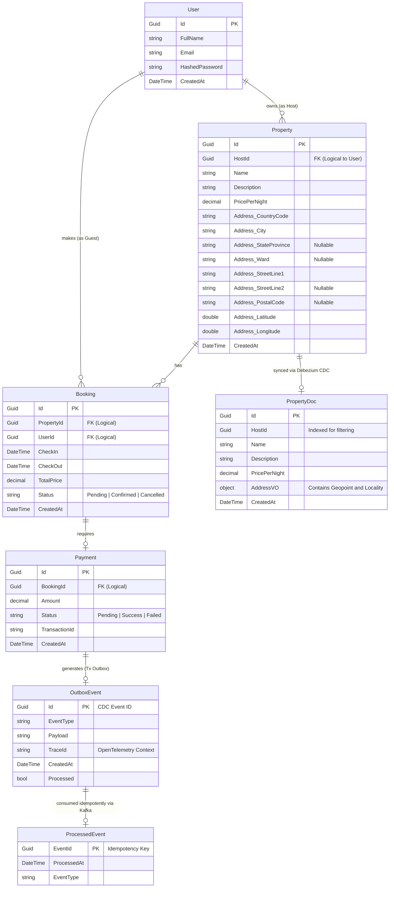

# Sơ đồ Cơ sở Dữ liệu Microservices

Dưới đây là sơ đồ thực thể liên kết (ERD) cho toàn bộ hệ sinh thái dịch vụ, thể hiện sự phân chia dữ liệu theo từng Database riêng biệt (Database-per-service pattern) cũng như các bảng hỗ trợ kiến trúc Event-driven (Outbox, Idempotency).

> [!TIP]
> Các liên kết (relationships) trong sơ đồ là các liên kết mang tính logic (Logical Relationships). Trong môi trường Database-per-service thực tế, các khóa ngoại (Foreign Keys) sẽ không có constraints vật lý ở cấp độ database để đảm bảo tính độc lập.

## Chú giải kiến trúc

* **Độc lập Dữ liệu:** Mỗi Microservice tự quản lý schema của mình. Dữ liệu cross-service được tham chiếu thông qua ID (GUID).
* **Outbox Pattern:** Tại `paydb`, bảng `OutboxEvent` được lưu cùng transaction với `Payment` để đảm bảo Debezium chắc chắn sẽ pick up event và đẩy lên Kafka mà không lo lỗi Dual-write.
* **Idempotency:** Tại `bookdb`, bảng `ProcessedEvent` giữ vai trò rào chắn bảo vệ logic xử lý Booking (Consumer), giúp hệ thống an toàn chặn đứng mọi sự kiện bị lặp lại do retries hoặc lỗi mạng.
* **Search Sync:** `PropertyDoc` trong Elasticsearch là một "bản chiếu" (projection/read-model) từ bảng `Property` (Postgres) thông qua luồng CDC, đảm bảo Search Engine luôn đồng bộ với Source of Truth.
