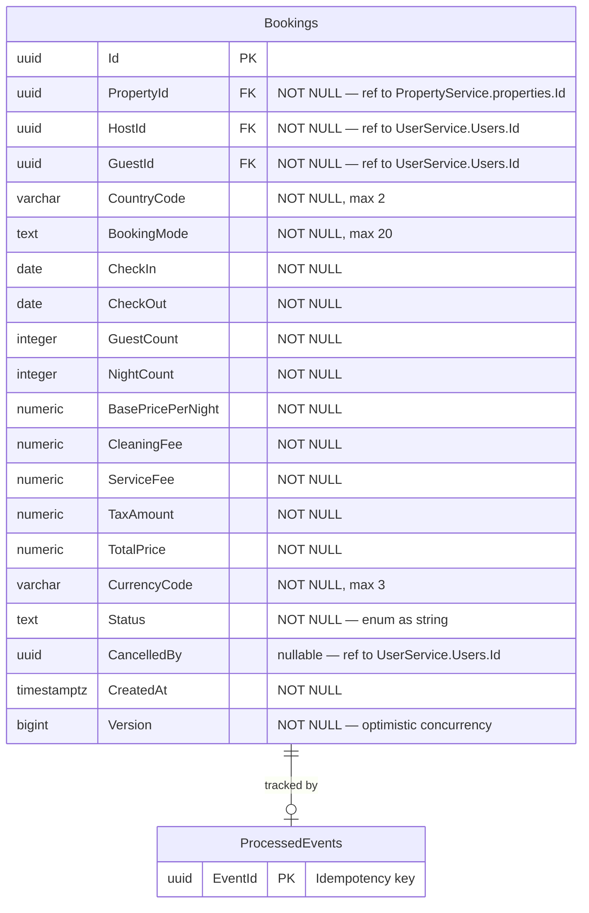
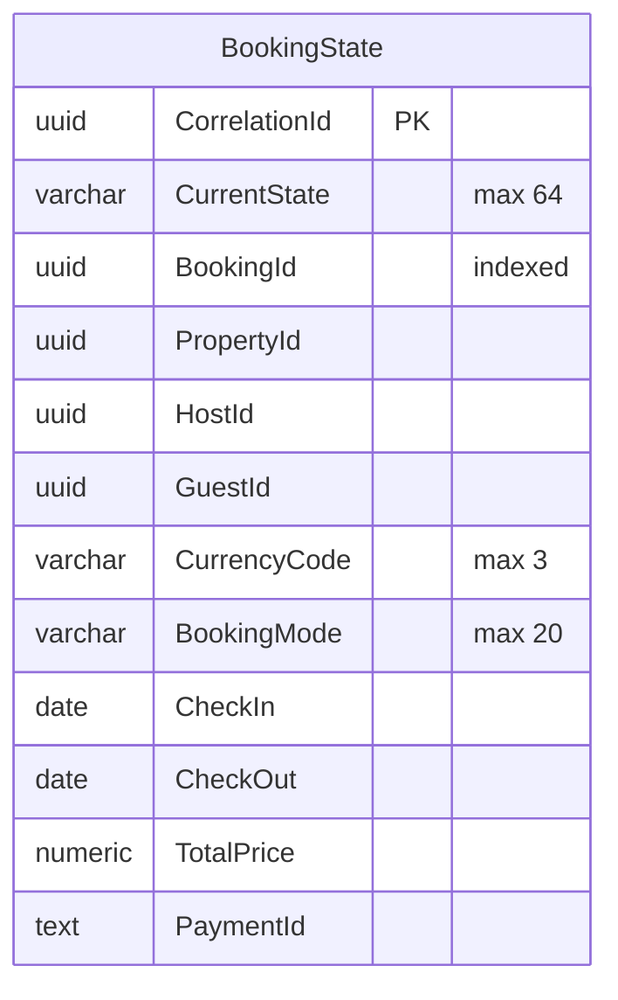

# BookingService — Database Schema

> Database: `bookdb` (PostgreSQL)

## ER Diagram

## Indexes

| Table | Index | Type | Notes |
|-------|-------|------|-------|
| Bookings | `idx_bookings_property_dates` | Filtered Unique | On (PropertyId, CheckIn, CheckOut) WHERE Status != 'Cancelled' — prevents double booking |
| Bookings | `idx_bookings_guest_id` | B-Tree | Optimize GetGuestBookings queries |
| Bookings | `idx_bookings_host_id` | B-Tree | Optimize GetHostBookings queries |

## Cross-Service References (Logical)

| Table | Column | References | Service |
|-------|--------|-----------|---------|
| Bookings | PropertyId | properties.Id | PropertyService |
| Bookings | HostId | Users.Id | UserService |
| Bookings | GuestId | Users.Id | UserService |
| Bookings | CancelledBy | Users.Id | UserService |

## Saga Database

BookingService also uses a separate **Saga database** (`BookingSagaDbContext`) managed by MassTransit for the booking state machine:

- The Saga DB runs as a separate PostgreSQL database and manages the booking workflow state machine (Created → PaymentPending → Confirmed → Cancelled, etc.).
- MassTransit Outbox tables (`InboxState`, `OutboxMessage`, `OutboxState`) are shared with the main booking DB.

## Notes

- `Status` stored as string enum: Pending, Confirmed, Cancelled, Completed, etc.
- `ProcessedEvents` table ensures idempotency for integration events.
- No internal FK constraints — all references are cross-service (logical FKs only, per database-per-service pattern).
- Optimistic concurrency via `Version` field inherited from `AggregateRoot`.
