# PaymentService — Database Schema

> Database: `paydb` (PostgreSQL)

## ER Diagram

```mermaid
erDiagram
    Payments {
        uuid Id PK
        uuid BookingId FK "NOT NULL — ref to BookingService.Bookings.Id"
        numeric Amount "NOT NULL, decimal(18,2)"
        varchar Currency "NOT NULL, max 3"
        text Status "NOT NULL — Pending|Completed|Failed|Refunded"
        varchar TransactionId "nullable, max 255"
        timestamptz CreatedAt "NOT NULL"
        timestamptz ExpiresAt "nullable — payment session timeout"
        varchar PaymentUrl "nullable, max 2048 — VNPay/Stripe checkout URL"
        bigint Version "NOT NULL, default 0 — optimistic concurrency"
    }

    PlatformSettings {
        uuid Id PK
        numeric PlatformFeePercent "NOT NULL, decimal(5,2)"
        numeric MinPayoutAmount "NOT NULL, decimal(18,2)"
        varchar DefaultCurrency "NOT NULL, max 3"
        timestamptz UpdatedAt "NOT NULL"
        varchar UpdatedBy "nullable, max 255"
    }

    PlatformFeeConfigs {
        uuid Id PK
        numeric FeePercentage "NOT NULL"
        varchar Description "nullable"
        boolean IsActive "NOT NULL"
        uuid ChangedBy "NOT NULL — ref to UserService.Users.Id"
        numeric PreviousValue "nullable"
        timestamptz CreatedAt "NOT NULL"
    }

    Payouts {
        uuid Id PK
        uuid HostId FK "NOT NULL — ref to UserService.Users.Id"
        numeric TotalEarnings "NOT NULL, decimal(18,2)"
        numeric PlatformFee "NOT NULL, decimal(18,2)"
        numeric PayoutAmount "NOT NULL, decimal(18,2)"
        varchar Currency "NOT NULL, max 3"
        text Status "NOT NULL — Pending|Approved|Completed|Failed"
        integer ItemCount "NOT NULL"
        uuid ApprovedBy "nullable — ref to UserService.Users.Id"
        timestamptz ApprovedAt "nullable"
        timestamptz CompletedAt "nullable"
        timestamptz CreatedAt "NOT NULL"
        bigint Version "NOT NULL, default 0"
    }

    PayoutItems {
        uuid Id PK
        uuid PayoutId FK "NOT NULL"
        uuid BookingId FK "NOT NULL — ref to BookingService.Bookings.Id"
        uuid PaymentId FK "NOT NULL — ref to Payments.Id"
        numeric BookingTotal "NOT NULL, decimal(18,2)"
        numeric ServiceFee "NOT NULL, decimal(18,2)"
        numeric HostEarning "NOT NULL, decimal(18,2)"
        date CheckIn "NOT NULL"
        date CheckOut "NOT NULL"
        varchar PropertyTitle "NOT NULL, max 500"
        varchar GuestName "NOT NULL, max 200"
    }

    HostBalances {
        uuid Id PK
        uuid HostId FK "NOT NULL — ref to UserService.Users.Id"
        varchar Currency "NOT NULL, max 3"
        numeric PendingBalance "NOT NULL, decimal(18,2)"
        numeric AvailableBalance "NOT NULL, decimal(18,2)"
        timestamptz UpdatedAt "NOT NULL"
        bigint Version "NOT NULL"
    }

    BalanceEntries {
        uuid Id PK
        uuid HostId FK "NOT NULL — ref to UserService.Users.Id"
        varchar Currency "NOT NULL, max 3"
        text Type "NOT NULL — enum: BookingCredit|PayoutDebit|RefundDebit etc."
        numeric PendingDelta "NOT NULL, decimal(18,2)"
        numeric AvailableDelta "NOT NULL, decimal(18,2)"
        uuid PaymentId FK "nullable — ref to Payments.Id"
        uuid PayoutId FK "nullable — ref to Payouts.Id"
        uuid BookingId FK "nullable — ref to BookingService.Bookings.Id"
        varchar Note "nullable, max 500"
        timestamptz CreatedAt "NOT NULL"
    }

    RefundRecords {
        uuid Id PK
        uuid PaymentId FK "NOT NULL — ref to Payments.Id"
        numeric Amount "NOT NULL, decimal(18,2)"
        varchar Reason "NOT NULL"
        boolean IsFullRefund "NOT NULL"
        uuid PerformedBy "NOT NULL — ref to UserService.Users.Id"
        uuid TicketId "nullable"
        timestamptz CreatedAt "NOT NULL"
    }

    Payouts ||--o{ PayoutItems : "has many (cascade)"
    Payments ||--o| RefundRecords : "has refund (cascade)"
    HostBalances ||--o{ BalanceEntries : "tracked by"
```

## Indexes

| Table | Index | Type | Notes |
|-------|-------|------|-------|
| Payments | `ix_payments_booking_pending` | Filtered Unique | On BookingId WHERE Status = 'Pending' — prevents multiple pending payments per booking |
| Payouts | `ix_payouts_host_id` | B-Tree | Optimize host payout queries |
| Payouts | `ix_payouts_status` | B-Tree | Optimize payout processing |
| PayoutItems | `ix_payout_items_payout_id` | B-Tree | FK index |
| PayoutItems | `ix_payout_items_booking_id` | B-Tree | Booking lookup |
| HostBalances | `ix_host_balances_host_currency` | Unique | On (HostId, Currency) — one balance per currency per host |
| BalanceEntries | `ix_balance_entries_host` | B-Tree | Host ledger query |
| BalanceEntries | `ix_balance_entries_payment` | B-Tree | Payment ledger query |
| BalanceEntries | `ix_balance_entries_payout` | B-Tree | Payout ledger query |

## Relationships (Internal FKs)

| From | To | Type | FK Column | On Delete |
|------|----|------|-----------|-----------|
| PayoutItems | Payouts | Many-to-One | PayoutId | CASCADE |
| RefundRecords | Payments | Many-to-One | PaymentId | CASCADE |

## Cross-Service References (Logical)

| Table | Column | References | Service |
|-------|--------|-----------|---------|
| Payments | BookingId | Bookings.Id | BookingService |
| PayoutItems | BookingId | Bookings.Id | BookingService |
| BalanceEntries | BookingId | Bookings.Id | BookingService |
| Payouts | HostId | Users.Id | UserService |
| HostBalances | HostId | Users.Id | UserService |
| BalanceEntries | HostId | Users.Id | UserService |
| PlatformFeeConfigs | ChangedBy | Users.Id | UserService |
| RefundRecords | PerformedBy | Users.Id | UserService |
| Payouts | ApprovedBy | Users.Id | UserService |

## Notes

- `PlatformSettings` is a singleton configuration row for global fee/payout settings.
- `PlatformFeeConfigs` tracks fee percentage changes over time (audit trail).
- `HostBalances` stores the current wallet balance per host per currency.
- `BalanceEntries` is the immutable ledger (append-only) recording every balance change.
- All monetary fields use `decimal(18,2)` for precision.
- Enums (`Status`, `Type`) stored as strings in PostgreSQL.
