# Booking Service

**Booking Service** is the engine that handles reservations. It is responsible for enforcing availability, locking dates to prevent double-booking, and managing the state transition of a booking lifecycle.

## 🧠 Domain Concepts
* **Concurrency & Double-Booking Prevention:** Employs database row-level locking or optimistic concurrency to ensure two users cannot book the exact same dates simultaneously.
* **Booking Lifecycle:** `Pending` (awaiting payment) -> `Confirmed` (payment success) -> `Cancelled` / `Completed`.
* **Outbox Pattern:** When a booking is confirmed, it writes a `BookingConfirmedEvent` to a local Outbox table in the same transaction. A background worker then publishes this to RabbitMQ, ensuring 100% consistency.

## 🗄️ Database Schema (PostgreSQL)

The primary tables in this microservice:

| Table Name | Description |
|------------|-------------|
| `BookingState` | Core metadata and storage for BookingState. |
| `Bookings` | Core metadata and storage for Bookings. |
| `InboxState` | Core metadata and storage for InboxState. |
| `OutboxMessage` | Core metadata and storage for OutboxMessage. |
| `OutboxState` | Core metadata and storage for OutboxState. |
| `ProcessedEvents` | Core metadata and storage for ProcessedEvents. |

### Entity Relationship Diagram (ERD)

```mermaid
erDiagram

    BookingState {
        CorrelationId uuid PK "not null"
        CurrencyCode character_varying "not null"
        CurrentState character_varying "not null"
        TotalPrice numeric "not null"
        CreatedAt timestamp_with_time_zone "not null"
        BookingId uuid "not null"
        GuestId uuid "not null"
        PropertyId uuid "not null"
        UpdatedAt timestamp_with_time_zone "null"
        ExpirationTokenId uuid "null"
    }

    Bookings {
        Id uuid PK "not null"
        Version bigint "not null"
        CountryCode character_varying "not null"
        CurrencyCode character_varying "not null"
        CheckIn date "not null"
        CheckOut date "not null"
        GuestCount integer "not null"
        NightCount integer "not null"
        BasePricePerNight numeric "not null"
        CleaningFee numeric "not null"
        ServiceFee numeric "not null"
        TaxAmount numeric "not null"
        TotalPrice numeric "not null"
        Status text "not null"
        CreatedAt timestamp_with_time_zone "not null"
        GuestId uuid "not null"
        HostId uuid "not null"
        PropertyId uuid "not null"
        CancelledBy uuid "null"
    }

    InboxState {
        Id bigint PK "not null"
        ReceiveCount integer "not null"
        Received timestamp_with_time_zone "not null"
        ConsumerId uuid "not null"
        LockId uuid "not null"
        MessageId uuid "not null"
        LastSequenceNumber bigint "null"
        RowVersion bytea "null"
        Consumed timestamp_with_time_zone "null"
        Delivered timestamp_with_time_zone "null"
        ExpirationTime timestamp_with_time_zone "null"
    }

    OutboxMessage {
        SequenceNumber bigint PK "not null"
        ContentType character_varying "not null"
        Body text "not null"
        MessageType text "not null"
        SentTime timestamp_with_time_zone "not null"
        MessageId uuid "not null"
        DestinationAddress character_varying "null"
        FaultAddress character_varying "null"
        ResponseAddress character_varying "null"
        SourceAddress character_varying "null"
        Headers text "null"
        Properties text "null"
        EnqueueTime timestamp_with_time_zone "null"
        ExpirationTime timestamp_with_time_zone "null"
        ConversationId uuid "null"
        CorrelationId uuid "null"
        InboxConsumerId uuid "null"
        InboxMessageId uuid "null"
        InitiatorId uuid "null"
        OutboxId uuid "null"
        RequestId uuid "null"
    }

    OutboxState {
        OutboxId uuid PK "not null"
        Created timestamp_with_time_zone "not null"
        LockId uuid "not null"
        LastSequenceNumber bigint "null"
        RowVersion bytea "null"
        Delivered timestamp_with_time_zone "null"
    }

    ProcessedEvents {
        EventId uuid PK "not null"
        EventType text "not null"
        ProcessedAt timestamp_with_time_zone "not null"
    }
```

## Indexes

### `BookingState`

- `IX_BookingState_BookingId`
- `PK_BookingState`

### `Bookings`

- `PK_Bookings`
- `idx_bookings_guest_id`
- `idx_bookings_host_id`
- `idx_bookings_property_dates`

### `InboxState`

- `AK_InboxState_MessageId_ConsumerId`
- `IX_InboxState_Delivered`
- `PK_InboxState`

### `OutboxMessage`

- `IX_OutboxMessage_EnqueueTime`
- `IX_OutboxMessage_ExpirationTime`
- `IX_OutboxMessage_InboxMessageId_InboxConsumerId_SequenceNumber`
- `IX_OutboxMessage_OutboxId_SequenceNumber`
- `PK_OutboxMessage`

### `OutboxState`

- `IX_OutboxState_Created`
- `PK_OutboxState`

### `ProcessedEvents`

- `PK_ProcessedEvents`

## 🔌 API Endpoints (FastEndpoints)

| Method | Path | Description |
|--------|------|-------------|
| **POST** | `/api/bookings` | Create a new booking (Pending status). |
| **GET**  | `/api/bookings/{id}` | Get details of a specific booking. |
| **GET**  | `/api/bookings/my-trips` | Get all bookings made by the current user. |
| **GET**  | `/api/bookings/my-reservations` | Get all bookings made on the host's properties. |
| **POST** | `/api/bookings/{id}/cancel` | Cancel an active booking (subject to refund rules). |
