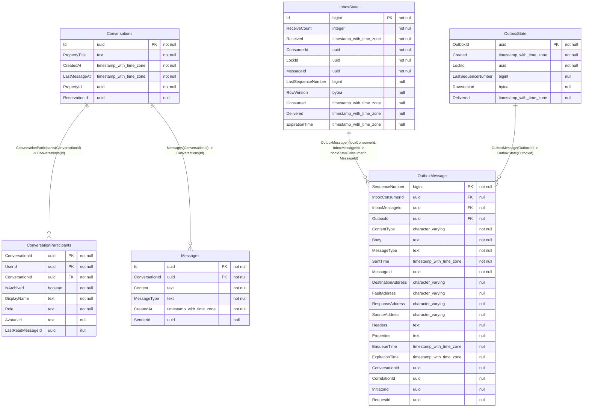

# Chat Service

**Chat Service** manages all real-time communication between Hosts and Guests. Unlike standard messaging apps, conversations here are strictly tied to a specific business context (a Property or a Booking).

## 🧠 Domain Concepts
* **Context-Bound Threads:** A conversation cannot exist in a vacuum. It must be linked to a `ContextId` (e.g., BookingId).
* **System Messages:** The service listens to RabbitMQ for events (like `BookingConfirmed` or `BookingCancelled`) and automatically injects immutable System Messages into the chat thread.
* **Real-Time Delivery:** Utilizes SignalR for WebSockets. A Redis Backplane is used to scale SignalR across multiple server instances.
* **Data Replication:** Since this service needs user names and avatars to display chat heads quickly, it subscribes to `UserProfileUpdatedEvent` via RabbitMQ and maintains a read-optimized copy of users in its own DB.

## 🗄️ Database Schema (PostgreSQL)

The primary tables in this microservice:

| Table Name | Description |
|------------|-------------|
| `ConversationParticipants` | Core metadata and storage for ConversationParticipants. |
| `Conversations` | Core metadata and storage for Conversations. |
| `InboxState` | Core metadata and storage for InboxState. |
| `Messages` | Core metadata and storage for Messages. |
| `OutboxMessage` | Core metadata and storage for OutboxMessage. |
| `OutboxState` | Core metadata and storage for OutboxState. |
| `o` | Core metadata and storage for O. |

### Entity Relationship Diagram (ERD)

## Indexes

### `ConversationParticipants`

- `PK_ConversationParticipants`
- `idx_participants_user_id`

### `Conversations`

- `PK_Conversations`
- `uq_conversation_property_no_res`
- `uq_conversation_property_res`

### `InboxState`

- `AK_InboxState_MessageId_ConsumerId`
- `IX_InboxState_Delivered`
- `PK_InboxState`

### `Messages`

- `PK_Messages`
- `idx_messages_conversation_created`

### `OutboxMessage`

- `IX_OutboxMessage_EnqueueTime`
- `IX_OutboxMessage_ExpirationTime`
- `IX_OutboxMessage_InboxMessageId_InboxConsumerId_SequenceNumber`
- `IX_OutboxMessage_OutboxId_SequenceNumber`
- `PK_OutboxMessage`

### `OutboxState`

- `IX_OutboxState_Created`
- `PK_OutboxState`

## 🔌 API Endpoints (FastEndpoints)

| Method | Path | Description |
|--------|------|-------------|
| **GET** | `/api/chat/conversations` | Get all active conversations for the current user. |
| **GET** | `/api/chat/conversations/{id}/messages` | Get paginated messages for a thread. |
| **POST**| `/api/chat/conversations/{id}/messages` | Send a new text/image message. |
| **POST**| `/api/chat/conversations/{id}/read` | Update the read-receipt watermark. |

## 📡 SignalR Hubs
* `/hubs/chat` - Real-time WebSocket connection for receiving incoming messages instantly.
