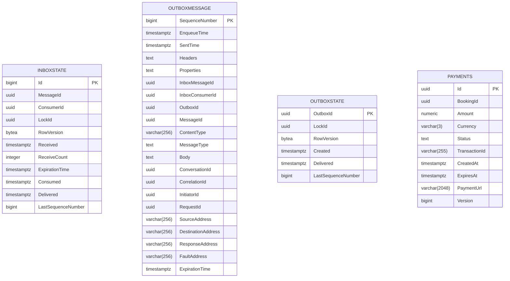

# Payment Service

**Payment Service** handles all financial transactions, integrating with third-party payment gateways (like Stripe, VNPay, or Momo). It isolates all webhook processing and PCI-compliance concerns from the core business services.

## 🧠 Domain Concepts
* **Payment Intents:** Creating an intent locks in a transaction amount and generates a payment URL/token for the client.
* **Webhook Processing:** Asynchronously listens to callbacks from payment providers to verify signatures and update payment statuses.
* **Event-Driven Fulfillment:** Upon successful payment, it publishes a `PaymentCompletedEvent` to RabbitMQ. The BookingService listens to this to mark reservations as `Confirmed`.

## 🗄️ Database Schema (PostgreSQL)

The primary tables in this microservice:

| Table Name | Description |
|------------|-------------|
| `InboxState` | Core metadata and storage for InboxState. |
| `OutboxMessage` | Core metadata and storage for OutboxMessage. |
| `OutboxState` | Core metadata and storage for OutboxState. |
| `Payments` | Core metadata and storage for Payments. |

### Entity Relationship Diagram (ERD)

## 🔌 API Endpoints (FastEndpoints)

| Method | Path | Description |
|--------|------|-------------|
| **POST** | `/api/payments/create-intent` | Initialize a payment session for a specific booking. |
| **GET**  | `/api/payments/{id}` | Check the status of a payment. |
| **POST** | `/api/payments/webhooks/vnpay` | Webhook endpoint for VNPay callbacks. |
| **POST** | `/api/payments/webhooks/stripe` | Webhook endpoint for Stripe callbacks. |
