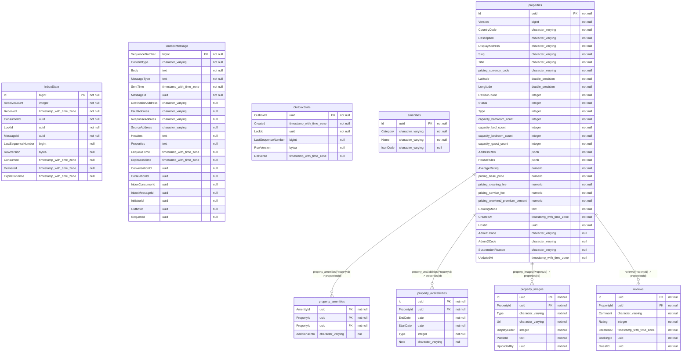

# Property Service

**Property Service** is the core bounded context responsible for managing the lifecycle, pricing, and configuration of all rental properties (listings) on the AirVnV platform. It acts as the primary "Write Model" for property data.

## 🧠 Domain Concepts

* **Property Lifecycle (State Machine):** Properties move through strict states: `Draft` (incomplete setup) -> `PendingReview` (awaiting admin approval) -> `Published` (visible to guests) -> `Suspended` / `Archived`.
* **Dynamic Pricing Engine:** A property doesn't just have a single price. It contains a `BasePrice`, `CleaningFee`, `ServiceFee`, and a dynamic `WeekendPremiumPercentage`.
* **Availability Management:** Hosts can block out specific date ranges manually, or they are automatically blocked when a Booking is confirmed.
* **Amenities & Rules:** Structured metadata describing what the property offers and rules guests must follow (e.g., `AllowPets`, `CheckInTime`).

## 🗄️ Database Schema (PostgreSQL)

The primary tables in this microservice:

| Table Name | Description |
|------------|-------------|
| `InboxState` | Core metadata and storage for InboxState. |
| `OutboxMessage` | Core metadata and storage for OutboxMessage. |
| `OutboxState` | Core metadata and storage for OutboxState. |
| `amenities` | Core metadata and storage for Amenities. |
| `o` | Core metadata and storage for O. |
| `properties` | Core metadata and storage for Properties. |
| `property_amenities` | Core metadata and storage for Property Amenities. |
| `property_availabilities` | Core metadata and storage for Property Availabilities. |
| `property_images` | Core metadata and storage for Property Images. |
| `reviews` | Core metadata and storage for Reviews. |

### Entity Relationship Diagram (ERD)

## Indexes

### `InboxState`

- `AK_InboxState_MessageId_ConsumerId`
- `IX_InboxState_Delivered`
- `PK_InboxState`

### `OutboxMessage`

- `IX_OutboxMessage_EnqueueTime`
- `IX_OutboxMessage_ExpirationTime`
- `IX_OutboxMessage_InboxMessageId_InboxConsumerId_SequenceNumber`
- `IX_OutboxMessage_OutboxId_SequenceNumber`
- `PK_OutboxMessage`

### `OutboxState`

- `IX_OutboxState_Created`
- `PK_OutboxState`

### `amenities`

- `PK_amenities`

### `properties`

- `IX_properties_CountryCode_Admin1Code_Admin2Code`
- `IX_properties_Slug`
- `PK_properties`

### `property_amenities`

- `PK_property_amenities`

### `property_availabilities`

- `IX_property_availabilities_PropertyId`
- `PK_property_availabilities`

### `property_images`

- `IX_property_images_PropertyId_Type`
- `PK_property_images`

### `reviews`

- `IX_reviews_BookingId`
- `IX_reviews_PropertyId`
- `PK_reviews`

## Indexes

### `InboxState`

- `AK_InboxState_MessageId_ConsumerId`
- `IX_InboxState_Delivered`
- `PK_InboxState`

### `OutboxMessage`

- `IX_OutboxMessage_EnqueueTime`
- `IX_OutboxMessage_ExpirationTime`
- `IX_OutboxMessage_InboxMessageId_InboxConsumerId_SequenceNumber`
- `IX_OutboxMessage_OutboxId_SequenceNumber`
- `PK_OutboxMessage`

### `OutboxState`

- `IX_OutboxState_Created`
- `PK_OutboxState`

### `amenities`

- `PK_amenities`

### `properties`

- `IX_properties_CountryCode_Admin1Code_Admin2Code`
- `IX_properties_Slug`
- `PK_properties`

### `property_amenities`

- `PK_property_amenities`

### `property_availabilities`

- `IX_property_availabilities_PropertyId`
- `PK_property_availabilities`

### `property_images`

- `IX_property_images_PropertyId_Type`
- `PK_property_images`

### `reviews`

- `IX_reviews_BookingId`
- `IX_reviews_PropertyId`
- `PK_reviews`

## 🔌 API Endpoints (FastEndpoints)

| Method | Path | Description |
|--------|------|-------------|
| **PATCH** | `/api/properties/{propertyId}/status` | Update property status (Publish/Unpublish/Archive) |
| **PUT** | `/api/properties/{propertyId}/reviews/{reviewId}` |  |
| **DELETE** | `/api/properties/{propertyId}/reviews/{reviewId}` |  |
| **PATCH** | `/api/properties/{propertyId}` | Update property information (Host only, partial update) |
| **GET** | `/api/properties/{propertyId}` |  |
| **DELETE** | `/api/properties/{propertyId}` | Delete property (Host only, Draft or Archived only) |
| **PUT** | `/api/properties/{propertyId}/location` | Update property location coordinates and address |
| **PATCH** | `/api/properties/{propertyId}/amenities/{amenityId}` | Update amenity additional information/notes |
| **DELETE** | `/api/properties/{propertyId}/amenities/{amenityId}` | Remove amenity from property (Host only) |
| **POST** | `/api/properties/{propertyId}/amenities/{amenityId}` | Add amenity to property (Host only) |
| **POST** | `/api/properties/{propertyId}/suspend` | Admin suspends property (Published → Suspended) |
| **POST** | `/api/properties/{propertyId}/submit` | Host submits property for review (Draft → PendingReview) |
| **POST** | `/api/properties/{propertyId}/reinstate` | Admin reinstates property (Suspended → Published) |
| **POST** | `/api/properties/{propertyId}/images/reorder` | Reorder property images |
| **DELETE** | `/api/properties/{propertyId}/images/{imageId}` | Remove property image (Host only) |
| **POST** | `/api/properties/{propertyId}/images/bulk` | Bulk add images to property (Host only) |
| **POST** | `/api/properties/{propertyId}/images` | Add image to property (Host only, Server-side upload) |
| **DELETE** | `/api/properties/{propertyId}/availability/{availabilityId}` | Remove property availability/blocked dates |
| **POST** | `/api/properties/{propertyId}/availability/block` | Block property dates (Calendar Management) |
| **GET** | `/api/properties/{propertyId}/reviews` |  |
| **POST** | `/api/properties/{propertyId}/reviews` |  |
| **GET** | `/api/properties/{propertyId}/basic-info` | Get basic information of a property (for internal microservice communication) |
| **GET** | `/api/properties/my` | Get all properties of the current host with pagination |
| **GET** | `/api/amenities` | Get all available amenities in the system |
| **POST** | `/api/properties` | Create a new property listing with images (Atomic) |
| **POST** | `/api/properties/{propertyId}/archive` | Host archives property (Published\|Suspended → Archived) |
| **POST** | `/api/properties/{propertyId}/approve` | Admin approve property (PendingReview → Published) |
