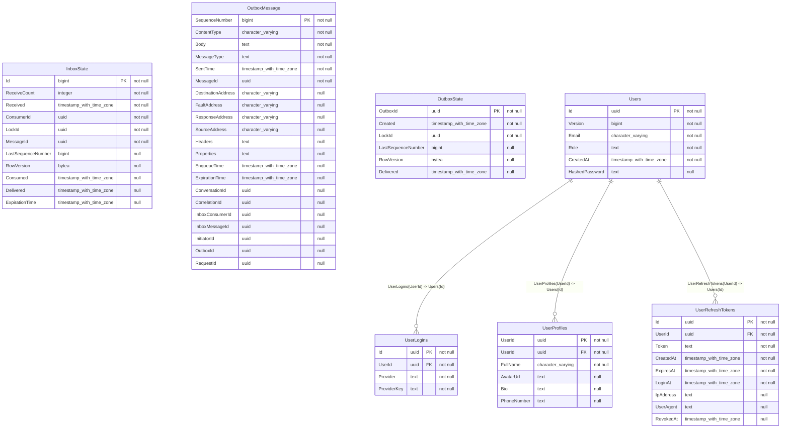

# User Service

**User Service** manages identities, authentication (JWT), and user profiles for both Guests and Hosts on the AirVnV platform. It acts as the central source of truth for user data and broadcasts `UserProfileUpdatedEvent`s for other services to replicate basic profile info (like Display Name and Avatar).

## 🧠 Domain Concepts
* **Authentication & Authorization:** Issues short-lived JWT Access Tokens and long-lived Refresh Tokens. Implements Google OAuth login.
* **Roles:** Users can be standard Guests or upgraded to Hosts.
* **Profile Management:** Handles avatar uploads via secure pre-signed URLs (S3/Cloudinary) and basic profile metadata.

## 🗄️ Database Schema (PostgreSQL)

The primary tables in this microservice:

| Table Name | Description |
|------------|-------------|
| `InboxState` | Core metadata and storage for InboxState. |
| `OutboxMessage` | Core metadata and storage for OutboxMessage. |
| `OutboxState` | Core metadata and storage for OutboxState. |
| `UserLogins` | Core metadata and storage for UserLogins. |
| `UserProfiles` | Core metadata and storage for UserProfiles. |
| `UserRefreshTokens` | Core metadata and storage for UserRefreshTokens. |
| `Users` | Core metadata and storage for Users. |
| `o` | Core metadata and storage for O. |

### Entity Relationship Diagram (ERD)

## Indexes

### `InboxState`

- `AK_InboxState_MessageId_ConsumerId`
- `IX_InboxState_Delivered`
- `PK_InboxState`

### `OutboxMessage`

- `IX_OutboxMessage_EnqueueTime`
- `IX_OutboxMessage_ExpirationTime`
- `IX_OutboxMessage_InboxMessageId_InboxConsumerId_SequenceNumber`
- `IX_OutboxMessage_OutboxId_SequenceNumber`
- `PK_OutboxMessage`

### `OutboxState`

- `IX_OutboxState_Created`
- `PK_OutboxState`

### `UserLogins`

- `IX_UserLogins_Provider_ProviderKey`
- `IX_UserLogins_UserId`
- `PK_UserLogins`

### `UserProfiles`

- `PK_UserProfiles`

### `UserRefreshTokens`

- `IX_UserRefreshTokens_UserId`
- `PK_UserRefreshTokens`

### `Users`

- `IX_Users_Email`
- `PK_Users`

## Indexes

### `InboxState`

- `AK_InboxState_MessageId_ConsumerId`
- `IX_InboxState_Delivered`
- `PK_InboxState`

### `OutboxMessage`

- `IX_OutboxMessage_EnqueueTime`
- `IX_OutboxMessage_ExpirationTime`
- `IX_OutboxMessage_InboxMessageId_InboxConsumerId_SequenceNumber`
- `IX_OutboxMessage_OutboxId_SequenceNumber`
- `PK_OutboxMessage`

### `OutboxState`

- `IX_OutboxState_Created`
- `PK_OutboxState`

### `UserLogins`

- `IX_UserLogins_Provider_ProviderKey`
- `IX_UserLogins_UserId`
- `PK_UserLogins`

### `UserProfiles`

- `PK_UserProfiles`

### `UserRefreshTokens`

- `IX_UserRefreshTokens_UserId`
- `PK_UserRefreshTokens`

### `Users`

- `IX_Users_Email`
- `PK_Users`

## 🔌 API Endpoints (FastEndpoints)

| Method | Path | Description |
|--------|------|-------------|
| **POST** | `/api/users/register` | Register a new user account. |
| **POST** | `/api/users/verify-email` | Verify email with OTP/Link. |
| **POST** | `/api/users/login` | Authenticate and get JWT. |
| **POST** | `/api/users/google-auth` | Authenticate using Google OAuth token. |
| **POST** | `/api/users/refresh-token` | Exchange refresh token for new JWT. |
| **GET**  | `/api/users/me` | Get current user's profile. |
| **PUT**  | `/api/users/me` | Update profile information. |
| **GET**  | `/api/users/{id}/public-profile` | Get public profile of a host/guest. |
| **GET**  | `/api/account/sessions` | List active sessions. |
| **POST** | `/api/account/sessions/revoke` | Revoke a specific refresh token session. |
| **POST** | `/api/account/change-password` | Update account password. |
